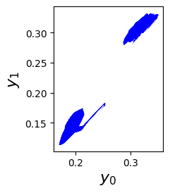
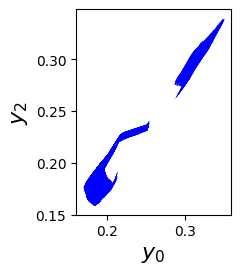

# Tool for Reachability Analysis and Repair of Neural Networks

Veritex is an object-oriented software programmed in Python.
It takes in two inputs, the network model and safety properties.
Veritex supports the standardized format ONNX and PyTorch for the network and the unified format Vnnnlib for the safety property.
With the network model and its safety properties, Veritex can compute the exact or over-approximated output reachable domain and also the entire unsafe input space if exists.
It supports the plotting of 2 or 3-dimensional polytopes.
When the repair option is enabled, it will produce a provable safe network in ONNX or PyTorch format.
<p align="center">
   
</p>
<p align="center"> Figure: An overview of Veritex architecture.</p>

## Install

Clone this repository to your local machine.

```bash
git clone https://github.com/Shaddadi/veritex.git
cd veritex
```

### Docker installing as a User (recommend for CAV'22 artifact)

1. Build the image from the dockerfile.

    ```bash
    sudo docker build . -t veritex_image
    ```

1. Create the docker container.

    ```bash
    sudo docker run --rm -it veritex_image bash
    ```

### Installing as a User

This tool is confirmed with only Python3.7.
Simply you may install veritex pkg with pip.

```bash
python3.7 -m pip install .
```

### Installing as a Developer

This tool is confirmed with only Python3.7.

1. Install required python packages.

    ```bash
    python3.7 -m pip install -e .
    ```

1. Set path to /veritex under this repository.

    ```bash
    export PYTHONPATH='<YOUR_REPO_PATH>/veritex/veritex'
    export OPENBLAS_NUM_THREADS=1
    export OMP_NUM_THREADS=1
    ```

## Run experiments

### CAV'22 Artifact

This section aims to reproduce results in the CAV'22 tool paper, inculding Figure 2&3&4 and Table 2&3. (to do: requirement for the hardware)
There are two versions for the artifact evaluation. 

One reproduces a subset of the results in the paper, including the safety verification of all instances, the repair of unsafe instaces (33/35) and the implementation of the related work ART for the repair comparison.

The other one reproduces all the results in the paper, including the safety verification of all instances, the repair of unsafe instaces (35/35) and the implementation of the related work ART for the repair comparison.


### Demo

This demo includes the computation of the exact output reachable domain of a neural network using our reachability analysis method.
It also includes the computation of its exact unsafe input space that leads to safety violations in the output using our Backtracking algorithm.
The neural network consists of 3 inputs, 2 outputs, and 8 layers with each having 7 neurons.
Results will be saved in /images.

```bash
cd examples/Demo
python main_demo.py
```

<p align="center">
    
</p>
<p align="center">
   Figure: Demo for our reachability analysis algorithms. Given an input domain (the blue box), our algorithms compute the exact output reachable domain and also the exact unsafe input subspace that leads to safety violation in the output domain.
</p>

### ACAS experiments

1. Run the verification of ACAS Xu neural networks. Info will be logged

    ```bash
    cd examples/ACASXu/verify
    ./verify_all_instances.sh
    ```

1. Run the repair of the unsafe ACAS Xu neural networks. Repaired networks will be saved in /logs and the info will be logged.

    ```bash
    cd examples/ACASXu/repair
    python main_repair_nnets.py
    ```

### Visualize Reachable Domains of ACASXu Networks

Visualize the output reachable domain

```bash
cd examples/ACASXu/repair
python veritex/methods/reachplot.py --property x,x --dims x x --network_path 'xxx' --savename 'xxx'
```

Example:

```bash
python veritex/methods/reachplot.py --property 3,4 --dims 0 1 --network_path '../nets/ACASXU_run2a_2_1_batch_2000.onnx --savename 'figure1''
python veritex/methods/reachplot.py --property 3,4 --dims 0 2 --network_path '../nets/ACASXU_run2a_2_1_batch_2000.onnx -- savename 'figure2''
```

<p align="center">
    
    
</p>
<p align="center">Figure: Output reachable domains of Network21 on Properties 3 and 4. They are projected on (y0,y1) and (y0, y2).
</p>
