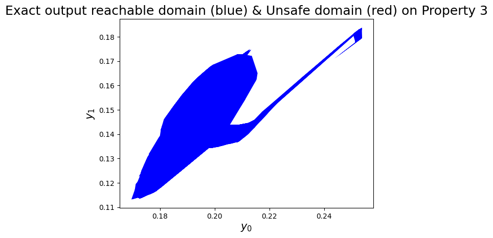
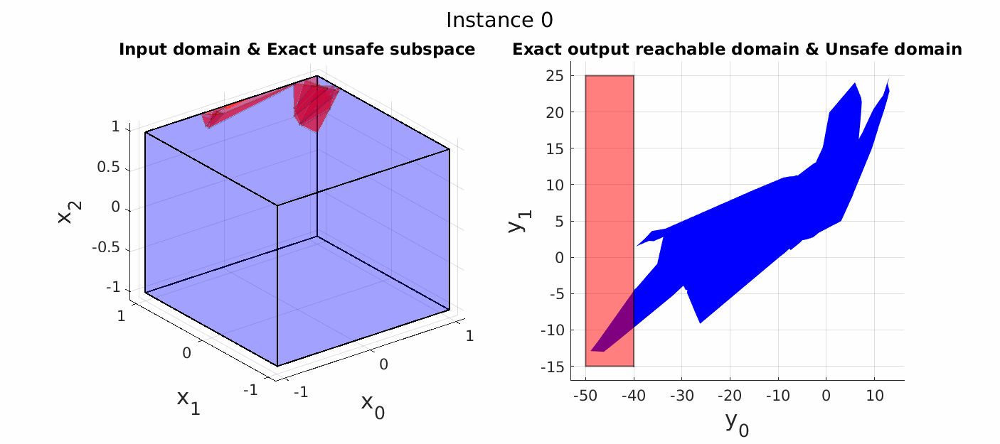

# Tool for Reachability Analysis and Repair of Neural Networks
## Run with Docker
1. Clone this repository to your local machine.
```bash
git clone https://github.com/Shaddadi/veritex.git
```
2. Build the image from the dockerfile
```bash
sudo docker build . -t veritex_image
```
3. Create the docker container
```bash
sudo docker run --rm -it veritex_image bash
```
4. Run the demo in the container. Results will be saved in /images.
```bash
cd examples/Demo
python main_demo.py
````
5. Run the verification of ACAS Xu neural networks. Info will be logged
```bash
cd examples/ACASXu/verify
./verify_all_instances.sh
```
6. Run the repair of the unsafe ACAS Xu neural networks. Repaired networks will be saved in /logs and the info will be logged.
```bash
cd examples/ACASXu/repair
python main_repair_nnets.py
```
7. Visualize the output reachable domain 
```bash 
cd examples/ACASXu/repair
python main_reachable_domain.py --property x --dims x x --network_path 'xxx'
```
  Example: 
```bash 
python main_reachable_domain.py --property 3 --dims 0 1 --network_path '../nets/ACASXU_run2a_2_1_batch_2000.onnx'
```
<figure>
     
     
</figure>

## To DO...
## Demo for Our Reachability Analysis Algorithm
<figure>
     
    <figcaption>Figure: Demo for our reachability analysis algorithms. The network consists of 3 inputs, 2 outputs and 8 layers with each having 7 neurons. Given an input domain (the blue box), our algorithms compute the exact output reachable domain and also the exact unsafe input subspace that leads to safety violation in the output domain.</figcaption>
</figure>


