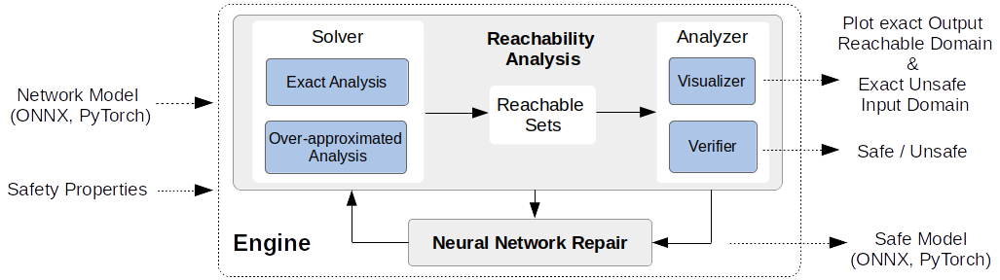
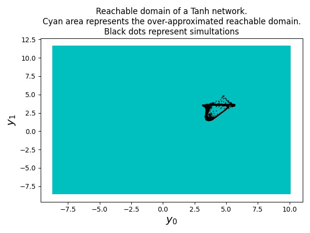

# Veritex: Tool for Reachability Analysis and Repair of Neural Networks

Veritex is an object-oriented software tool programmed in Python for verifying and repairing neural networks. It takes in two inputs, the network model and safety properties. Veritex supports the standardized format ONNX and PyTorch for the network and the unified format Vnnnlib for the safety property. With the network model and its safety properties, Veritex can:  
* compute the exact or over-approximated output reachable domain and also the entire unsafe input space if exists,
* plot 2 or 3-dimensional reachable domains,
* produce a provable safe network in ONNX or PyTorch format when the repair option is enabled.

<p align="center">
   
</p>
<p align="center"> Figure: An overview of Veritex architecture.</p>

## Installation and System Requirements

Clone this repository to your local machine, which we assume has 32GB RAM or more, and where the artifact is executable through Docker on most common host operating systems (Linux/Ubuntu and Windows 11 have been tested).

```bash
git clone https://github.com/Shaddadi/veritex.git
cd veritex
```

### Option 1: docker installing as a User (recommended for SEFM'22 and FORMATS'22 artifact evaluation)

1. Assuming Docker is installed, build the Docker image from the dockerfile (ignore sudo if using a Windows host in these steps).

    ```bash
    sudo docker build . -t veritex_image
    ```

2. Create and start the docker container.

    ```bash
    sudo docker run --name veritex --rm -it veritex_image bash
    ```

### Option 2: installing as a User

This tool has been confirmed to work and tested with only Python3.7.

1. Install veritex pkg with pip.

   ```bash
   python -m pip install .
   ```

2. Set path to /veritex under this repository.

   ```bash
   export PYTHONPATH='<YOUR_REPO_PATH>/veritex'
   export OPENBLAS_NUM_THREADS=1
   export OMP_NUM_THREADS=1
   ```

### Option 3: installing as a Developer

This tool has been confirmed to work and tested with only Python3.7.

1. Install required python packages.

    ```bash
    python -m pip install -e .
    ```

2. Set path to /veritex under this repository.

    ```bash
    export PYTHONPATH='<YOUR_REPO_PATH>/veritex'
    export OPENBLAS_NUM_THREADS=1
    export OMP_NUM_THREADS=1
    ```

## FORMATS'22 Artifact Evaluation

This artifact aims to reproduce results in the FORMATS'22 paper, including **Figures 3, 4, and 5** and **Tables 1 and 2**. Results are stored in 'veritex/FORMATS22/results'.. We recommend using the Dockerized set up described above for installing the artifact.
Linux host systems are suggested, but Windows hosts have also been tested.  There are two versions for the artifact evaluation. The difference between these two versions is that the first one runs faster, as it does not include the repair of two neural networks that consumes a large amount of memory and time.

**Caution**: The results in **Figures 3, 4, and 5** may be slightly different from the ones in the paper because each run of the repair method cannot be guaranteed to produce the exact same safe network. 

**Caution**: On *Windows* hosts, users who encounter the error '\r command not found' when executing the artifact, please run the following commands before the shell script. The update may not be required, but the dos2unix tool can be used to address the line endings if this error arises. Note this should be done in the FORMATS22 directory, where these reproduce_resultsX.sh scripts reside.
   ```bash
   apt-get update
   apt-get install dos2unix
   dos2unix reproduce_results1.sh
   dos2unix reproduce_results2.sh
   ```

1. The first fast version reproduces the results in the paper except for two hard instances (taking a total of ~230 mins), including
   * repair of 33/35 unsafe instances (data generation for Figure 3 and most of results in Table 2&3) (~40 mins),
   * the minimal repair of 33/35 unsafe instances (data generation for Figure 3 and most of results in Table 2&3) (~60 mins),
   * implementation of the related work ART for the repair comparison (~90 mins),
   * generation of figures and tables (~40 mins, majority of the time is spent on the plot of reachable domains).

   This version requires at least 32 GB memory.

   ```bash
   cd artifact/FORMATS22
   bash reproduce_results1.sh
      ```

2. The second version reproduces all the results in the paper (~760 mins), including
   * repair of all 35/35 unsafe instances (data generation for Figure 3 and Table 2&3) (~280 mins),
   * the minimal repair of all 35/35 unsafe instances (data generation for Figure 3 and Table 2&3) (~350 mins),
   * implementation of the related work ART for the repair comparison (~90 mins),
   * generation of figures and tables (~40 mins, majority of the time is spent on the plot of reachable domains).

   The hardware requirements for second version are comparable to what we tested on: AWS r5.12xlarge instance, 48vCPUs, 384 GB memory, no GPU.

   ```bash
   cd artifact/FORMATS22
   bash reproduce_results2.sh
   ```

3. Export results from docker to host. If there is a 'permission' error, update the docker installation first. Here are also some potential [solutions](https://github.com/docker/for-linux/issues/564). For PATH_TO_YOUR_HOST, replace e.g. with a . for the current working directory.
   ```bash
   sudo docker cp veritex:/veritex/artifact/FORMATS22/results/. <PATH_TO_YOUR_HOST>
   ```
## SEFM'22 Artifact

Linux systems are suggested. This artifact aims to reproduce results in the SEFM'22 tool paper, including **Figure 2&3&4** and **Table 2**. Results are stored in 'veritex/artifact/SEFM22/results'. There are two versions for the artifact evaluation. The difference between these two versions is that the first one does not include the repair of two neural networks which consumes a large amount of memory and time. 

**Caution**: Reachable domains of networks in **Figure 3&4** may be slightly different from the ones in the paper because each run of the repair method can not guarantee to produce the exact same safe network. 

**Caution**: For *Windows* users who encounter the error '\r command not found' when implementing the artifact, please run the following commands before the shell script.
   ```bash
   apt-get update
   apt-get install dos2unix
   dos2unix reproduce_results1.sh
   dos2unix reproduce_results2.sh
   ```

1. The first version reproduces the results in the paper except for two hard instances (~170 mins), including
   * safety verification of all instances (data generation for Figure 2) (~2 mins),
   * repair of 33/35 unsafe instances (data generation for Figure 3 and most of results in Table 2&3) (~40 mins),
   * repair of an unsafe DNN agent (data generation for Figure 4) (~6 mins),
   * implementation of the related work ART for the repair comparison (~90 mins),
   * generation of figures and tables (~40 mins, majority of the time is spent on the plot of reachable domains).

   This version requires at least 32 GB memory.

   ```bash
   cd artifact/SEFM22
   bash reproduce_results1.sh
      ```

2. The second version reproduces all the results in the paper (~410 mins), including
   * safety verification of all instances (data generation for Figure 2) (~2 mins),
   * repair of all 35/35 unsafe instances (data generation for Figure 3 and Table 2&3) (~280 mins),
   * repair of an unsafe DNN agent (data generation for Figure 4) (~6 mins),
   * implementation of the related work ART for the repair comparison (~90 mins),
   * generation of figures and tables (~40 mins, majority of the time is spent on the plot of reachable domains).

   The hardware requirement for second version is AWS, CPU: r5.12xlarge, 48vCPUs, 384 GB memory, no GPU.

   ```bash
   cd artifact/SEFM22
   bash reproduce_results2.sh
   ```

3. Export results from docker to host.
   ```bash
   sudo docker cp cav_veritex:/veritex/artifact/artifact/SEFM22/results/. <PATH_TO_YOUR_HOST>
   
## Run experiments
### Demo

This section describes how to run additional demonstrations and experiments beyond those reproduced above.

This demo includes the computation of the exact output reachable domain of a neural network using our reachability analysis method.
It also includes the computation of its exact unsafe input space that leads to safety violations in the output using our Backtracking algorithm.
The neural network consists of 3 inputs, 2 outputs, and 8 layers with each having 7 neurons.
Results will be saved in '/images'.

   ```bash
   cd examples/Demo
   python main_demo.py
   ```

<p align="center">
    
</p>
<p align="center">
   Figure: Demo for our reachability analysis algorithms. Given an input domain (the blue box), our algorithms compute the exact output reachable domain and also the exact unsafe input subspace that leads to safety violation in the output domain.
</p>

Reuse: compute the exact output rachable domain and the unsafe input subspace of a DNN
1. Create a DNN object using [FFNN](https://github.com/Shaddadi/veritex/blob/master/veritex/networks/ffnn.py) and enable  ['exact_outputd'](https://github.com/Shaddadi/veritex/blob/master/veritex/networks/ffnn.py#L62) and ['unsafe_inputd'](https://github.com/Shaddadi/veritex/blob/master/veritex/networks/ffnn.py#L61)
2. Create a [safety property](https://github.com/Shaddadi/veritex/blob/master/veritex/utils/sfproperty.py) by specifying the lower and upper bounds of the input domain and the set representation'FVIM' or 'Flattice'
3. Set up and run the parallel framework using [SharedState](https://github.com/Shaddadi/veritex/blob/master/veritex/methods/shared.py) and [Worker](https://github.com/Shaddadi/veritex/blob/master/veritex/methods/worker.py)
4. Collect results and plot using [reachplot](https://github.com/Shaddadi/veritex/blob/master/veritex/methods/reachplot.py)


### Verify Neural Networks

This section describes how to verify a new neural network not already analyzed within the Veritex examples, illustrated as well for an ACASXu example.

   ```bash
   cd examples/ACASXu/verify
   python verify_all_instances.py
   ```
   Reuse: verify a neural network on multiple safety properties using [verify](https://github.com/Shaddadi/veritex/blob/master/veritex/methods/verify.py)
   ```bash
   python veritex/methods/verify.py \
   --property 'path_to_property1' ... 'path_to_propertyn' \
   --property_name 'name1' ... 'namen' \ 
   --network_path 'path_to_model' \
   --network_name 'model_name'
   ```
   
   ACASXu Example. Results will be logged.
   ```bash
   cd examples/ACASXu/verify
   python ../../../veritex/methods/verify.py \
   --property '../nets/prop_1.vnnlib' '../nets/prop_2.vnnlib' '../nets/prop_3.vnnlib' '../nets/prop_4.vnnlib' \
   --property_name 'prop_1' 'prop_2' 'prop_3' 'prop_4' \
   --network_path '../nets/ACASXU_run2a_1_1_batch_2000.onnx' \
   --network_name 'N11'
   
   ```

### Repair Unsafe Neural Networks

This section describes how to repair a new neural network not already analyzed within the Veritex examples.

   ```bash
   cd examples/ACASXu/repair
   python repair_nnets.py
   ```
   
Reuse: repair a neural network on multiple safety properties
   1. Build a repair object using [REPAIR](https://github.com/Shaddadi/veritex/blob/master/veritex/methods/repair.py)
   2. Select parameters for the retraining process 
   3. Execute the repair function [repair_model_classification](https://github.com/Shaddadi/veritex/blob/master/veritex/methods/repair.py#L322) or [repair_model_regular](https://github.com/Shaddadi/veritex/blob/master/veritex/methods/repair.py#L247)


### Visualize Reachable Domains of Neural Networks

Visualize the output reachable domain using [reachplot](https://github.com/Shaddadi/veritex/blob/master/veritex/methods/reachplot.py)

   ```bash
   python veritex/methods/reachplot.py \
   --property 'path_to_property1'...'path_to_propertyn' \
   --network_path 'path_to_model' \
   --dims x x \
   --savename 'xxx'
   ```

Example. Results will be logged into '/figures':

   ```bash
   cd examples/ACASXu/repair
   python ../../../veritex/methods/reachplot.py \
   --property '../nets/prop_3.vnnlib' '../nets/prop_4.vnnlib' \
   --network_path '../nets/ACASXU_run2a_2_1_batch_2000.onnx' \
   --dims 0 1 \
   --savename 'figures/reachable_domain_property_3,4_dims0_1'


   python ../../../veritex/methods/reachplot.py \
   --property '../nets/prop_3.vnnlib' '../nets/prop_4.vnnlib' \
   --network_path '../nets/ACASXU_run2a_2_1_batch_2000.onnx' \
   --dims 0 2 \
   --savename 'figures/reachable_domain_property_3,4_dims0_2'
   ```

<p align="center">
    
    
</p>
<p align="center">Figure: Output reachable domains of Network21 on Properties 3 and 4. They are projected on (y0,y1) and (y0, y2).
</p>

### Over Approximate Output Reachable Domain of A DNN with Vzono
Over approximate reachable domains of networks [Demo](https://github.com/Shaddadi/veritex/blob/master/examples/Demo/demo_vzono.py). Results will be logged into '/figures'.
   ```bash
   cd examples/Demo
   python demo_vzono.py
   ```
<p align="center">
    
    
   
</p>
<p align="center">Figure: Over approximated reachable domains of networks with ReLU, Tanh, Sigmoid, respectively.
</p>

Reuse: over approximate output reachable domain of a DNN with Vzono
1. Create a DNN object using [FFNN](https://github.com/Shaddadi/veritex/blob/master/veritex/networks/ffnn.py)
2. Create a [safety property](https://github.com/Shaddadi/veritex/blob/master/veritex/utils/sfproperty.py) by specifying the lower and upper bounds of the input domain and the set representation Vzono
3. Set up and run the parallel framework using [SharedState](https://github.com/Shaddadi/veritex/blob/master/veritex/methods/shared.py) and [Worker](https://github.com/Shaddadi/veritex/blob/master/veritex/methods/worker.py)
4. Collect results and plot using [reachplot](https://github.com/Shaddadi/veritex/blob/master/veritex/methods/reachplot.py)


### Fast Reachability Analysis (Under-approximation) of A CNN
Fast reachability analysis of pixelwise perturbation of CNNs using [Method](https://github.com/Shaddadi/veritex/blob/master/veritex/networks/cnn.py#L787). Results will be logged into '/figures'.
   ```bash
   examples/CIFAR10
   python main_cifar10.py
   ```

<p align="center">
    
</p>
<p align="center">Figure: Fast Reachability analysis of CNNs with input pixels under perturbation. Blue area represents the reachable domain. Black dots represent simultations.
</p>
